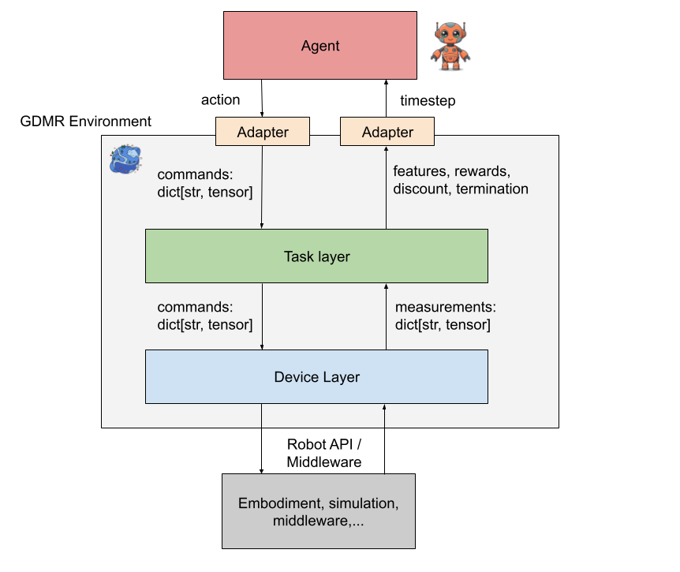
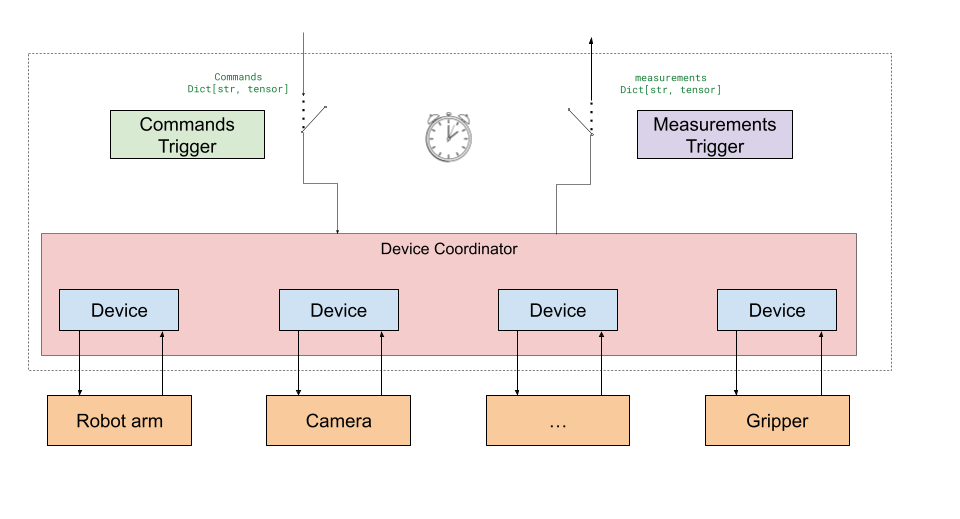
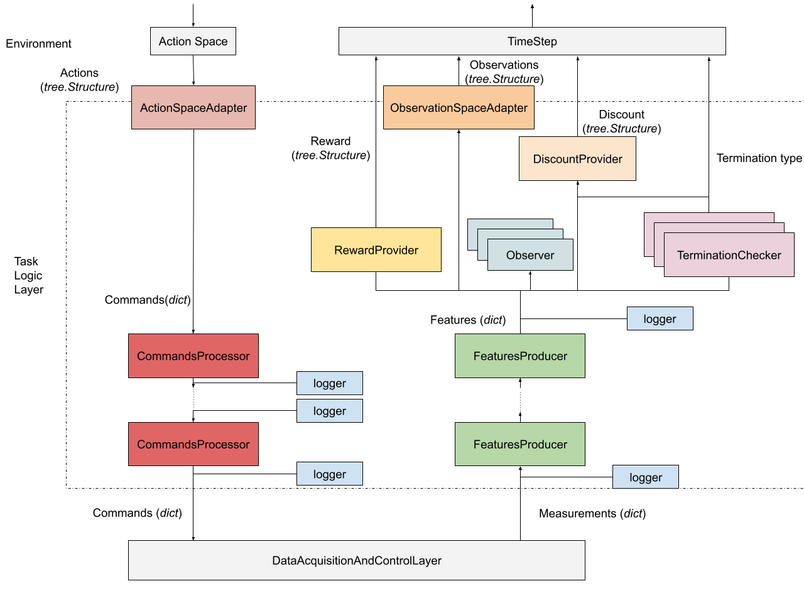

# Core Concepts

REAF is built on a layered architecture that promotes **modularity**,
**reusability**, and a clear **separation of concerns**. This design separates
the high-level logic of a task from the low-level details of hardware or
simulation control.

The core of a REAF environment is composed of distinct layers that manage the
flow of data from the agent to the robot and back.

The primary components are:

*   **Environment**: The main entry point that orchestrates the interaction
    between all other layers.
*   **Task Layer**: Defines the "rules" of the task, such as
    rewards, terminations, and task-specific features.
*   **Device Layer**: Provides a standardized
    interface to the robot hardware or simulation.
*   **Adapters**: Translates data between the agent's action/observation space
    and the environment's internal command/feature space.
*   **Handlers**: Manages custom logic for events like resets and episode
    endings.

### Definitions

Understanding the flow of data in REAF requires a clear distinction between the
following key terms. They represent the transformation of data from the agent's
intent to the hardware's response and back.

*   **Action**: The output of the agent's policy. It represents the agent's
    intent for what it wants to do in the environment (e.g., "move end-effector
    to position X").

*   **Command**: A low-level instruction sent to the hardware or simulation,
    derived from the agent's **action**. This is the concrete signal sent to the
    actuators (e.g., "set joint torques to [τ₁, τ₂, ...]"). The conversion from
    **action** to **command** is handled by **Action Adapter** first and then
    potentially processed by the **Task Layer**.

*   **Measurement**: Raw data received directly from the sensors on the hardware
    or in the simulation (e.g., raw joint encoder values, raw pixel values from
    a camera).

*   **Feature**: A piece of semantically meaningful information derived from raw
    **measurements**. Features are computed by the **Task Layer** to represent the
    state of the environment in a way that is useful for defining the task
    (e.g., the Cartesian coordinates of the end-effector, calculated from joint
    angles).

*   **Observation**: The data that is actually passed back to the agent. An
    **observation** is typically a subset or a transformation of the available
    **features**, structured to match the input specification of the agent's
    policy.

*   **TimeStep**: A container object that bundles together all the information
    the environment sends back to the agent after each step. It typically
    contains the **observation**, the **reward**, the **discount factor**, and
    the current step type (e.g., `FIRST`, `MID`, `LAST`).

### Environment

The `Environment` class is the top-level interface for your robotics
environment, conforming to the
[GDM Robotics Environment interface](https://github.com/google-deepmind/gdm_robotics/blob/main/src/gdm_robotics/interfaces/environment.py).
It acts as the central coordinator, managing the state and directing the flow of
information between the Task Layer and the Device Layer.

Its key responsibilities include:

*   **`reset_with_options()`**: Resets the environment to an initial state. This
    involves resetting the Device Layer and computing the first set of features and
    observations.
*   **`step()`**: Advances the environment by one timestep. It takes an agent's
    action, passes it through the Task Layer and the Device Layer, and returns a `TimeStep` object
    containing the new observation, reward, and status.
*   **`action_spec()`** and **`timestep_spec()`**: Define the structure and data
    types for agent actions and environment timesteps.
*   **Logging**: Provides hooks to add and remove loggers for monitoring the
    environment's internal state.

### Adapters

Adapters act as **translators** between the agent's world and the environment's
world. Since an agent may be designed to work with many different environments,
its action and observation spaces may not perfectly match the internal commands
and features of a specific task.

*   **`ActionSpaceAdapter`**: Converts the agent's actions (e.g., a continuous
    vector) into a structured command dictionary that the Task Layer can understand.
*   **`ObservationSpaceAdapter`**: Transforms the rich feature dictionary from
    the Task Layer into an observation format (e.g., a flat array or a dictionary of
    tensors) that the agent expects.

### Reset and End-of-Episode Handlers

REAF provides handlers for executing custom logic at critical points in an
episode's lifecycle.

*   **`EnvironmentReset`**: Defines the behavior for resetting the environment.
    REAF gives you complete control over this process, allowing you to implement
    complex, state-dependent reset procedures tailored to your needs. This can
    be used, for example, to reset hardware or randomize object positions.
*   **`EndOfEpisodeHandler`**: Provides an `on_end_of_episode_stepping()`
    callback that is invoked when an episode terminates. This is useful for
    final logging, analysis, or cleanup operations.

### Device Layer

The **Device Layer** is the component that directly
interfaces with the robot's hardware or simulation. Its primary responsibility
is to act as a bridge between the abstract, tensor-based world of the REAF
environment and the specific APIs of the robotics hardware.

The Device Layer is designed to be a thin and stable layer, focused solely on the task
of translating data. It converts NumPy arrays from the **Task Layer**
into low-level commands for the robot and, in the other direction,
collects raw sensor data and organizes it into a dictionary of measurements. All
task-specific logic, such as calculating rewards or complex features, should be
handled by the Task Layer, not the Device Layer. This separation of concerns ensures that the
Device Layer is highly reusable across different tasks and experiments.

#### Core Components of the Device Layer

The Device Layer's design is centered around a few key concepts that promote modularity
and reusability:

*   **`Device`**: This is the basic building block of the Device Layer. A `Device`
    represents a single, self-contained component of the robot, such as an arm,
    a camera, or a gripper. Each `Device` is responsible for defining its own
    command and measurement specifications and for implementing the logic to
    interact with its corresponding hardware.

*   **`DeviceCoordinator`**: While `Device`s are designed to be independent, a
    `DeviceCoordinator` is used to manage and coordinate a collection of
    `Device`s that make up a complete robotic system. It handles the lifecycle
    of the devices and provides synchronization points to ensure that commands
    are sent and measurements are read in a coordinated manner.

*   **`Trigger`**: A `Trigger` is an optional component that can be used to
    control the timing of the Device Layer's operations. For example, a trigger can be
    used to ensure that the DACL waits for a specific event before reading
    sensor data, like a new camera frame, or more commonly, to guarantee
    consistent stepping frequency.

### Task Layer

The **Task Layer** is a core component of REAF that is responsible
for defining the logic of a specific robotics task, independent of the
underlying hardware. Think of it as defining the **rules of the game**. It acts
as a bridge between the low-level, hardware-specific data from the **Device Layer**
and the high-level, task-specific information required by the agent.

The Task Layer is designed to be highly modular and customizable, allowing researchers
to easily adapt a given robotic setup to a wide range of experiments. It is
composed of several distinct components, each responsible for a specific part of
the data transformation process.

#### Data Flow in the Task Layer

At each step of the environment, the Task Layer processes data in a sequential flow:

1.  **Action to Command**: The agent's **action** is first processed by a series
    of **Command Processors**, which transform the high-level action into a
    low-level command that the Device Layer can understand.

2.  **Measurement to Features**: The raw **measurements** from the Device Layer are then
    processed by **Output Producers**, which generate higher-level **features**
    that are more meaningful for the task.

3.  **Reward, Termination, and Discount**: These features are then used by the
    **Reward Provider**, **Termination Checkers**, and **Discount Provider** to
    compute the reward, check for episode termination, and calculate the
    discount factor.

#### Core Components of the Task Layer

The Task Layer is composed of the following key components:

*   **`CommandProcessor`**: Modifies the agent's actions before they are sent to
    the Device Layer. For example, a command processor could be used to convert a 4D
    Cartesian control action from the agent into a full 6D cartesian command
    that the robot's cartesian controller expects.

*   **`FeatureProducer`**: Takes the raw measurement from the Device Layer and generates
    additional, more abstract features. These producers are immutable, meaning
    they can only add new features, not modify existing ones.

*   **`RewardProvider`**: Computes the reward for the current timestep based on
    the available features.

*   **`TerminationChecker`**: Determines whether the current episode should
    terminate or be truncated based on the current state. The Task Layer can have
    multiple termination checkers, and their results are combined to make a
    final decision.

*   **`DiscountProvider`**: Computes the discount factor for the current
    timestep, which is often dependent on the termination state.

*   **`FeaturesObserver`**: A passive component that can observe the full set of
    features without modifying them. This is primarily used for logging and
    debugging purposes.

Together, these components provide a flexible and powerful framework for
defining complex robotics tasks in a structured and reusable way.
